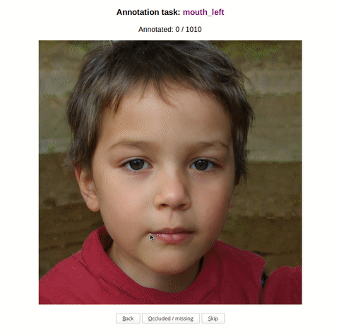

# Ridiculously simple landmark annotation tool 

__Quickly annotate many images, one landmark at a time__

Below, I am marking the location of the left corner of the mouth of the person in the image. 



It usually takes me less than 3 minutes to annotate 100 images. (The images in the demo are generated 
by [stylegan2](https://github.com/NVlabs/stylegan2) and all have the mouth in a similar location. In 
this case it takes me only around 2 minutes to annotate 100 images). 

You likely want to have multiple landmarks per image (e.g. also location of eyes and nose). With this
tool, you need to annotate each image multiple times, once per landmark. So multiply those 3 minutes
by the number of different landmarks you want to annotate. 

The tool is completely agnostic to the types of landmarks you want to add, i.e. does not have to
be face landmarks. You just set a name for your landmark and get clicking.


## Why?

Most annotation tools work on a per-image basis, i.e. you at once add all annotations (bounding boxes,
tags, landmarks, etc) to an image.

I prefer to work on a per-task basis, i.e. only doing one type of annotation (in this case one type
of landmark) for all images. Of course, that means haveing to do multiple passes through the images if
I want multiple landmarks. For me, avoiding the task-switching in my brain and in the UI is still worth it.

If you also like to work on a per-task basis, then this might be the right tool for you.

## Installation

Python>=3.7

```
pip install -r requirements.txt
```

## Configuration

```
cp config.py.sample config.py
```

##### IMAGE_DIR

The directory where the images you want to annotate are located. 

* Only .png and .jpg are supported
* Subfolders are not supported, i.e. all images must lie directly in IMAGE_DIR

##### ANNOTATION_DIR

The directory where the annotations will be stored. Will be automatically created if it does not exist.

##### LANDMARK

The name of the landmark you want to annotate. (e.g. in the video above, LANDMARK=mouth_left).

## Usage 

1. Start the annotation server 
```
python start.py
```

2. Open your browser at [http://localhost:5000](http://localhost:5000) and start annotating.

You can supply an alternative hostname and port to `start.py`.

## Changing the landmark type

You can stop annotating at any point in time and switch to a different landmark type.

1. `CTRL+C` to stop the annotation server
2. Change `config.py` to new landmark name
3. `python start.py`
4. Navigate to [http://localhost:5000](http://localhost:5000)

You can go also change to the previous landmark type by following these steps. The tool will pick up
right where you left things off last time.

## Annotation format

* There will be one sub-folder per image
* There will be one annotation file per landmark

##### Example 

If you have following images:

```
IMAGE_DIR/
  - 1.png
  - 2.png
```

And you have already annotated the landmarks "eye_left" and "eye_right", then your annotations
folder will contain:

```
annotations/
  - 1.png /
     - eye_left.json
     - eye_right.json
  - 2.png /
     - eye_left.json
     - eye_right.json
```

The content of the `.json` file will look like this:

```

# if the landmark was visible and annotated
{
   "coordinates": {"x": 450, "y": 496},
   "status": "ok"
}

# if the landmark was marked as occluded/missing
{
   "status": "occluded/missing"
}

```

If you press skip, no .json file will be created for this image.

## Postprocessing

#### Drawing the landmarks onto the images

```
python postprocessing_draw_landmarks.py
```

Please see the script for further information.

#### Merge the many landmark files into one file per image

```
python postprocessing_merge_annotations.py
```

Please see the script for further information.

## F.A.Q.

### I want to change something in the config file

1. `CTRL+C` to stop the annotation server
2. Change `config.py` 
3. `python start.py`
4. Navigate to [http://localhost:5000](http://localhost:5000)

Important: you always need to restart the server, so that it picks up on the changes.

### I changed something on the filesystem (e.g. added images, deleted annotation files)

The server will only pick up on these changes after a restart!

1. `CTRL+C` to stop the annotation server
2. `python start.py`
3. Navigate to [http://localhost:5000](http://localhost:5000)

### I am not happy with my annotation

##### If the server is still running

Simply press the "back" button until you find the image and try again.

##### If the server was stopped

Delete the corresponding annotation `.json` file and restart the server.

### Is it possible to have the same landmark type multiple times in the same image (e.g. two noses)?

No.

### Does the tool export to PascalVOC or any other standard annotation format?

No, but should not be too hard to add this to `postprocessing_merge_annotations.py`.

### Can two people annotate at the same time?

##### Using the same server instance?

No, they would overwrite each other's landmarks.

##### Using two server instances with different landmarks (but same IMAGE_DIR and ANNOTATION_DIR)

Yes.

### Can I get landmark proposals from a computer vision model?

No.

### Can it do other annotations beyond landmarks?

No. 